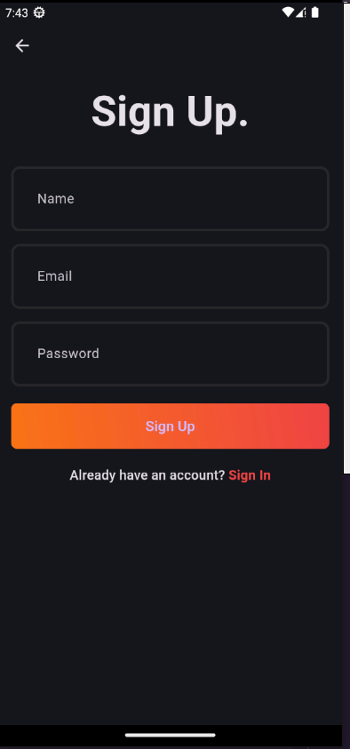
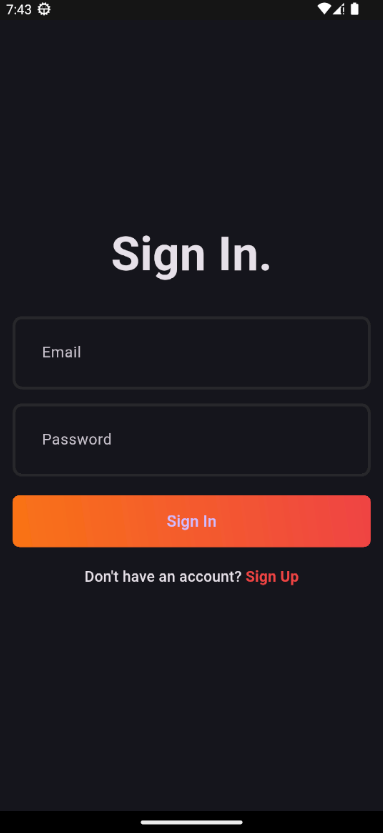
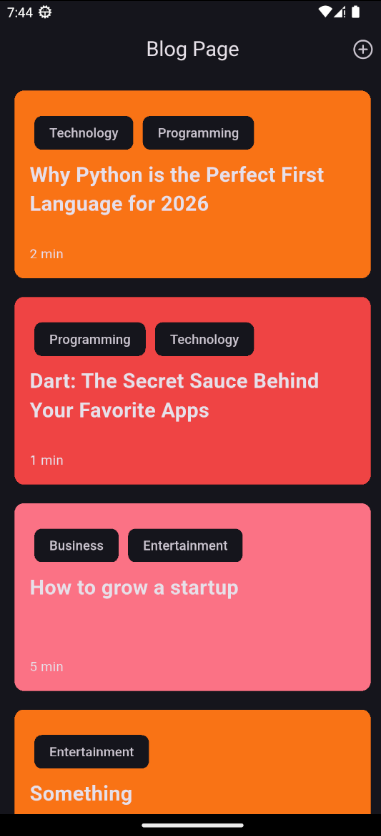
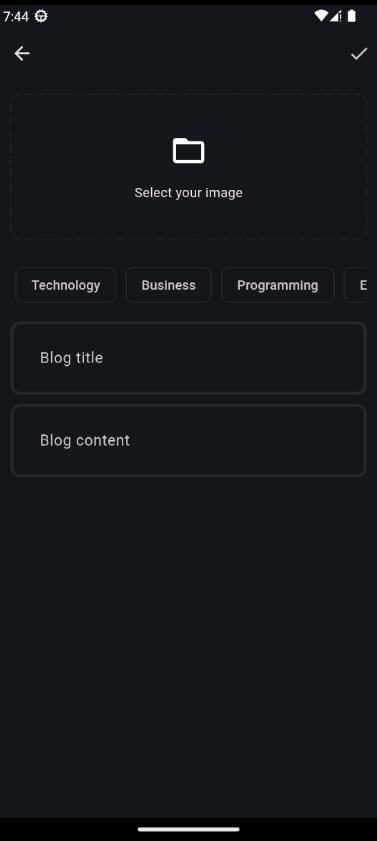

# Blogg App

A modern Flutter blogging application that allows users to create, read, and share blog posts with offline-first capabilities. Built with clean architecture principles and state management using BLoC pattern.

## � Screenshots

| Sign Up | Sign In | Blog Home |
|---------|---------|-----------|
|  |  |  |

| Add Blog | Blog Detail |
|----------|------------|
|  |  |

## �🚀 Features

- **User Authentication**
  - Sign up with email and password
  - Secure login with authentication persistence
  - Automatic session management
  - Logout functionality

- **Blog Management**
  - Create new blog posts with rich content
  - Add featured images to blog posts
  - Categorize posts with topics/tags
  - View all published blogs
  - Display blog author information
  - Responsive blog card UI

- **Offline Support**
  - Local caching of blog data using Hive
  - Automatic fallback to cached data when offline
  - Seamless sync when connection restored

- **Network Management**
  - Real-time internet connection checking
  - Graceful error handling for network failures
  - User-friendly error messages

## 📁 Project Structure

```
lib/
├── core/                          # Core functionality shared across features
│   ├── common/                    # Shared widgets and components
│   ├── constants/                 # App-wide constants
│   ├── cubits/                    # Global cubits (AppUserCubit)
│   ├── error/                     # Error handling and exceptions
│   ├── network/                   # Network connectivity checking
│   ├── secrets/                   # API keys and sensitive data
│   ├── theme/                     # App theming and styling
│   ├── usecase/                   # Base usecase interface
│   └── utills/                    # Utility functions and helpers
│
├── features/                      # Feature modules
│   ├── auth/                      # Authentication feature
│   │   ├── data/
│   │   │   ├── datasources/       # Remote auth data source
│   │   │   ├── models/            # Auth data models
│   │   │   └── repositories/      # Auth repository implementation
│   │   ├── domain/
│   │   │   ├── entities/          # Auth entities
│   │   │   ├── repositories/      # Auth repository interface
│   │   │   └── usecases/          # Auth use cases (signup, login)
│   │   └── presentation/
│   │       ├── bloc/              # Authentication BLoC
│   │       ├── pages/             # Auth UI pages
│   │       └── widgets/           # Auth-related widgets
│   │
│   └── blog/                      # Blog feature
│       ├── data/
│       │   ├── datasources/       # Remote and local blog data sources
│       │   ├── models/            # Blog data models
│       │   └── repositories/      # Blog repository implementation
│       ├── domain/
│       │   ├── entities/          # Blog entities
│       │   ├── repositories/      # Blog repository interface
│       │   └── usecases/          # Blog use cases
│       └── presentation/
│           ├── bloc/              # Blog BLoC
│           ├── pages/             # Blog UI pages
│           └── widgets/           # Blog-related widgets
│
└── main.dart                      # App entry point
```

## 🏗️ Architecture

This project follows **Clean Architecture** with the following layers:

### **Presentation Layer**
- BLoC for state management
- Stateless/Stateful widgets for UI
- Event-driven architecture

### **Domain Layer**
- Entities (pure business logic models)
- Repositories (abstract interfaces)
- Use Cases (business logic implementation)

### **Data Layer**
- Models (DTO with JSON serialization)
- Data Sources (Remote & Local)
- Repository Implementation

## 🛠️ Technologies & Dependencies

### Core Framework
- **Flutter**: Cross-platform mobile framework
- **Dart**: Programming language

### State Management
- **flutter_bloc**: BLoC pattern implementation
- **get_it**: Service locator / Dependency injection

### Backend & Database
- **supabase_flutter**: Backend as a Service (Authentication & Database)
- **hive**: Local database for offline caching

### UI/UX
- **cupertino_icons**: iOS-style icons
- **dotted_border**: Custom border widget
- **intl**: Internationalization and date formatting

### Utilities
- **fpdart**: Functional programming (Either, Option types)
- **image_picker**: Image selection from device
- **uuid**: Unique identifier generation
- **internet_connection_checker_plus**: Network connectivity detection
- **path_provider**: Access to device directories

## 📋 Prerequisites

- Flutter SDK (version 3.9.0 or higher)
- Dart SDK (compatible with Flutter version)
- Supabase account (for backend setup)
- Android Studio / Xcode (for emulator/device testing)

## 🔧 Setup & Installation

### 1. Clone the Repository
```bash
git clone https://github.com/Ikhtiar76/blogg_app
cd blogg_app
```

### 2. Install Dependencies
```bash
flutter pub get
```

### 3. Configure Supabase
- Create a Supabase project at [supabase.com](https://supabase.com)
- Get your Supabase URL and Anon Key
- Update `lib/core/secrets/app_secrets.dart` with your credentials:

```dart
class AppSecrets {
  static const String supabaseurl = 'YOUR_SUPABASE_URL';
  static const String supabaseAnonkey = 'YOUR_SUPABASE_ANON_KEY';
}
```

### 4. Run the App
```bash
flutter run
```

## 📱 Features Walkthrough

### Authentication Flow
1. User launches app → checks if already logged in
2. If not logged in → redirects to login/signup page
3. User can create new account or login with existing credentials
4. On success → navigated to blog home page

### Blog Posting Flow
1. User navigates to "Add New Blog" from blog page
2. Fills in: Title, Content, Topics, and Featured Image
3. On submit → blog is uploaded to Supabase (requires internet)
4. Success → returned to blog home page with new post visible

### Offline Blog Viewing
1. User views blogs while online → data cached locally
2. User goes offline → still can view cached blogs
3. Offline indicator shown if fetch fails due to no connection
4. When online again → fresh blogs fetched and displayed

## 🔐 Security

- API keys stored in `secrets/app_secrets.dart` (add to `.gitignore`)
- Supabase handles authentication securely
- User sessions managed automatically
- No sensitive data stored in plain text

## 🐛 Error Handling

The app implements comprehensive error handling:
- Network errors → fallback to cached data
- Server errors → user-friendly error messages
- Input validation → before submitting to server
- Timeout handling → for slow connections

## 📊 State Management Flow

```
User Action → BLoC Event → Use Case → Repository 
    → Data Source (Remote/Local) → BLoC State → UI Update
```

## 🎨 UI/UX Features

- **Dark Theme**: App-wide dark theme for comfortable viewing
- **Material Design**: Following Material Design 3 principles
- **Responsive Layout**: Adapts to different screen sizes
- **Loading States**: Loader widget for async operations
- **Error Feedback**: Snackbars for user notifications

## 🚀 Future Enhancements

- [ ] Edit/Delete blog posts
- [ ] Search and filter blogs
- [ ] User profiles and follow system
- [ ] Blog comments and interactions
- [ ] Push notifications
- [ ] Dark/Light theme toggle
- [ ] Bookmark favorite blogs
- [ ] Blog sharing to social media

## 📝 Development Guidelines

### Adding New Features
1. Create feature folder under `lib/features/`
2. Follow the 3-layer architecture (Presentation, Domain, Data)
3. Use BLoC for state management
4. Write use cases for business logic
5. Implement proper error handling

### Code Style
- Follow Dart style guide
- Use meaningful variable names
- Add comments for complex logic
- Keep functions small and focused

## 🤝 Contributing

1. Create a new branch for your feature
2. Make your changes following the project structure
3. Test thoroughly
4. Submit a pull request with clear description
